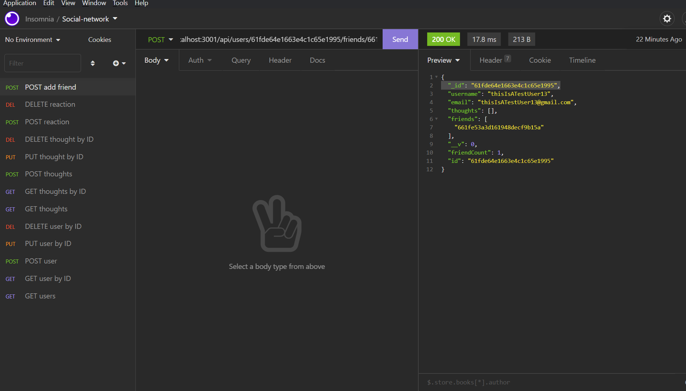

# Social Network API

## Table of contents
* [General info](#general-info)
* [Technologies](#technologies)
* [Installation](#installation)
* [Demo](#demo)

## General info
This is a social network API that allows userss to make lists of friends, to react to their friends' thoughts, and post and react to their own thoughts.

## Technologies
Project is created with (all through VScode extension):
* CSS
* JavaScript
* Express.js
* Mongoose
* Insomnia

	
## Installation

Installation is fairly simple. All you have to do is clone the repository and run npm install in the terminal to download all the dependencies, including Mongoose and express.js packages. After installing all the dependencies, run 'npm start' to run the application. Watch the demo below to see how the application operates.

## Demo

[Demo](https://watch.screencastify.com/v/Q2EqxufldAmwQ3lgnH57)
